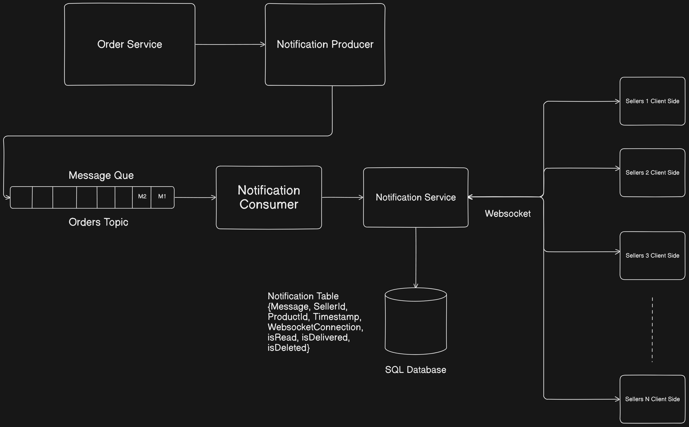

# Single Responsibility Notification System

In this system design I have made a service which will handle notifications for orders. So basically it incorporates the following functionality.

- I am using Orders notification as an example for instance a Seller in an ecommerce website wants to get notification when ever his/her porducts sell out.
- So to manage the notifications out of the order service it self we will need a proper stream service in between the order and notification service.
- For that we are using kafka message queues for managing the notiifcations and crafting out the message that will be sent across.
- Web sockets will be used incorporate real time notifications in case the user is online.

##### Deep Dive into the design

To understand the design more thoroughly lets deep dive into the different aspects of it.

* First of all we have our order service which will first checks if the seller subscribed to the notification of his orders or not.
* If it really subscribed to it the message will be generated with the other information like product id user id seller id timestamp etc.
* Later down the road it will be sent to the producer the producer enques it into the Orders topic which is a queue of messages holding the notifications.
* The consumer constantly recieving the Notifications and passing it to the actual notification service down the line.
* The notification service will ensure that all the messages are also stored int the database.
* Moreover if the seller is online a websocket connection is established between the client and the server over the http.
* If the connection is established the seller will get the notification in real time.
* And if the user was not online the notification will be stored in the database.
* And when the user comes online we will ensure that all the unsent messages should be sent to the seller.

---

###### Scalalbility Factor

Observing the design we have the following for scalalbility in our system

* Kafka message queue can scale using the kafka brokers which can scale up and down with the needs.
* We have notification service which can be horizontally scale up by replicating it on different machines for that we can use loadbalancer. and each replica can joing a same consumer group ensuring only one consumer gets the message in a round robin or anyother manner.

This is how scalalability factor is acheived in this system.

###### Fault Tolerance

Fault tolerance is observed as follows

* By having different replicas of service we can ensure the system stays avaialble all the time.
* We have mesage brokers which can be deployed on different machines and can be avaialble all the time.

Lastly we are ensuring every message will be delivered to the seller by persisting them in a database if they are not online they will get the notification.

## **Contribution**

Please make an issue if you find anything wrong in the design it will help me and you learn. Thanks.
